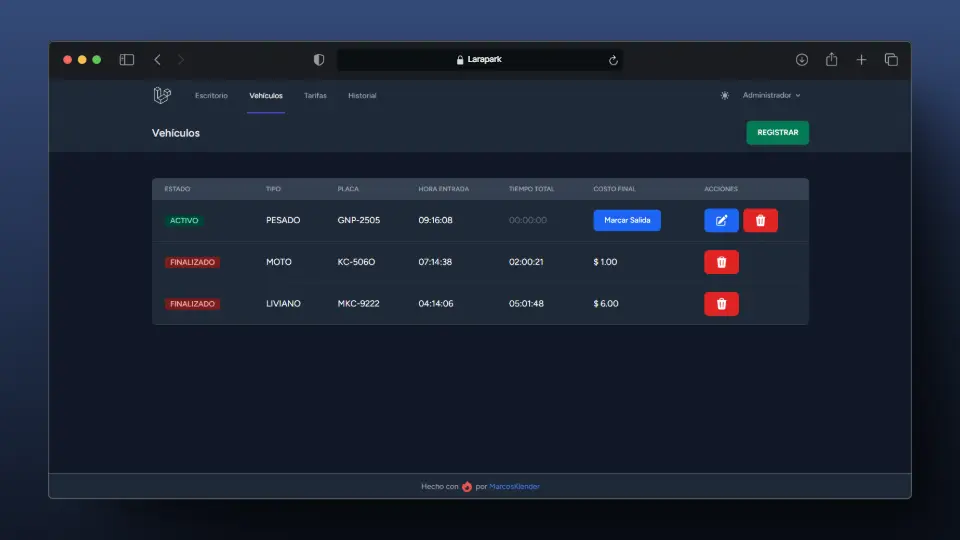
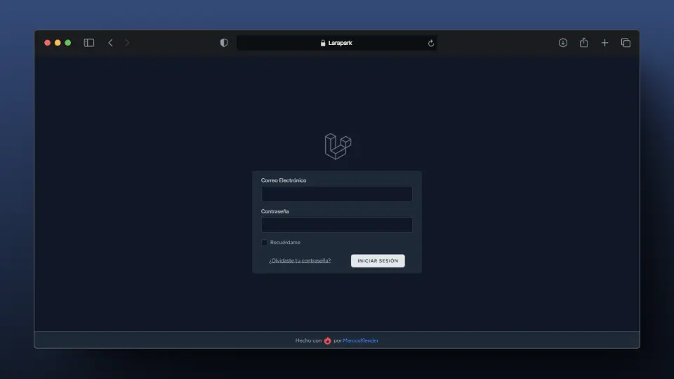
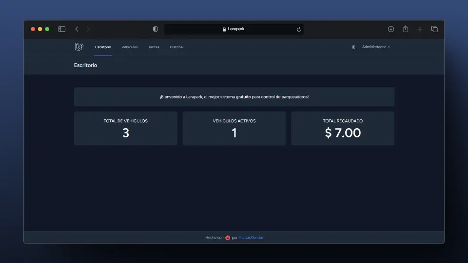
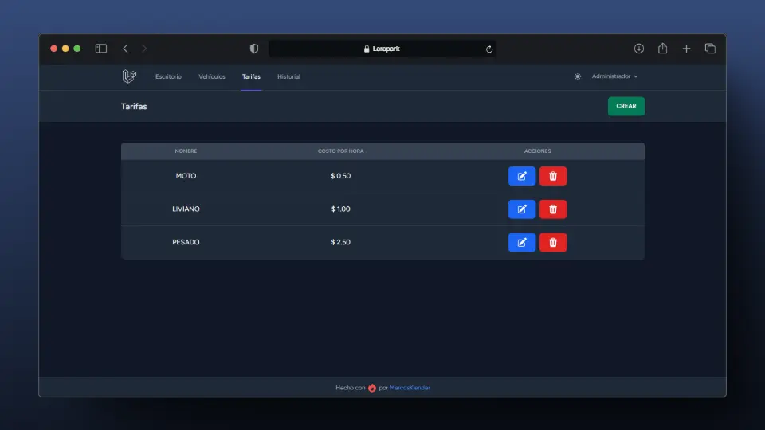
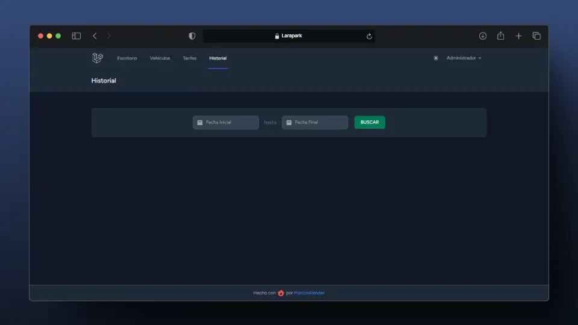
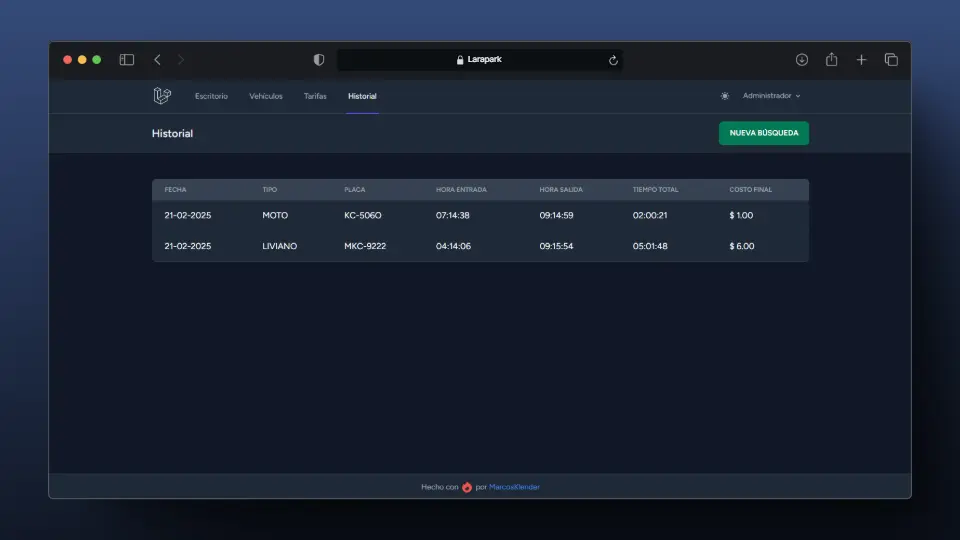

<a id="readme-top"></a>

<div align="center">


</div>

<h1 align="center">Larapark</h1>

<div align="center">


Manage your parking lot in the most efficient way, totally free!

</div>




## Table of Contents

  <ol>
    <li>
      <a href="#about-the-project">About The Project</a>
    </li>
    <li>
      <a href="#getting-started">Getting Started</a>
      <ul>
        <li><a href="#prerequisites">Prerequisites</a></li>
        <li><a href="#installation">Installation</a></li>
      </ul>
    </li>
    <li><a href="#screenshots">Screenshots</a></li>
    <li><a href="#license">License</a></li>
  </ol>


## About The Project

Larapark is a web-based parking management system designed to streamline the administration of parking lots and spaces. Built with Laravel, this free application provides a user-friendly interface and essential features for efficient parking management.

Key functionalities include vehicle registration, tracking of active vehicles, billing calculations, and comprehensive tariff management. Users can easily monitor total revenue, manage vehicle records, and customize parking rates. With dark mode compatibility and a robust authentication system, Larapark ensures a secure and visually appealing experience for parking lot operators. This project aims to enhance operational efficiency and improve the overall management of parking facilities. 

<p align="right"><a href="#readme-top">Back to top ⬆️</a></p>


## Getting Started

### Prerequisites

- **Laravel 10**
- **Composer**

### Installation

1. Clone this repo to your computer:
   ```sh
   git clone git@github.com:MarcosKlender/Larapark.git
   ```
2. Install composer dependencies with:
   ```sh
   cd Larapark
   composer install
   ```
3. Install npm dependencies with:
   ```sh
   npm install
   ```
   or
   ```sh
   pnpm install
   ```
4. Use this to create your own `.env` file:
   ```sh
   cp .env.example .env
   ```
5. Update the `.env` file with your database credentials and run:
   ```sh
   php artisan migrate --seed
   php artisan key:generate
   ```
6. Launch the local server with:
   ```sh
   php artisan serve
   ```
7. In other tab, launch the npm server and start using the app:
   ```sh
   npm run dev
   ```
   or
   ```sh
   pnpm run dev
   ```
8. Use the default credentials (don't forget to change it):
   ```sh
   Email: admin@larapark.com
   Password: admin123
   ```

<p align="right"><a href="#readme-top">Back to top ⬆️</a></p>


## Screenshots

### Login


### Dashboard


### Vehicles


### Rates


### History




<p align="right"><a href="#readme-top">Back to top ⬆️</a></p>


## License

Distributed under the MIT License. This app doesn't collect any information at all.

<p align="right"><a href="#readme-top">Back to top ⬆️</a></p>
